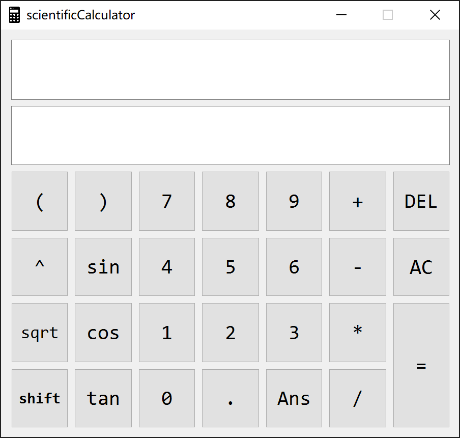

# Practical Scientific Calculator
Radioactive *`V1.1`*
<h3 align="center">Curriculum Design for OPP C++</h3>

---

[](https://www.microsoft.com/zh-cn/software-download/windows10ISO/)  [](https://git-scm.com/)  [](https://visualstudio.microsoft.com/zh-hans/vs/)  [](https://www.qt.io/zh-cn/)


#### Contents

* [Highlights](#highlights)
* [Usage](#usage)
* [Development](#development)





##### `High Accuraccy Algorithm` is going to be added in the next release, ~~if I have free time~~.


## Highlights

* Designed for utility, it works like a real scientific calculator.
* Modern C++ with QT5.14.2
* Easy to read my code even no comments.
* Simply download the
  [boxed_exe](https://github.com/Radioactive-jkl/cppSciCal/blob/master/sciCalculator/scientificCalculator_boxed.exe)
  and start using.


## Usage

1. Download the 
   [boxed_exe](https://github.com/Radioactive-jkl/cppSciCal/blob/master/sciCalculator/scientificCalculator_boxed.exe)
   then use.
    
2. Use **`calculate.h`** and **`calculate.cpp`** as *toolFunction*.
   [*`testFunc_cmake`*](https://github.com/Radioactive-jkl/cppSciCal/blob/master/sciCalculator/testFunc_cmake) is a demo.
    ```c++
    /*
     * testFunc_cmake
     *  ├── out
     *  ├── CMakeLists.txt
     *  └── src
     *       ├── CMakeLists.txt
     *       ├── calculate.h
     *       ├── calculate.cpp
     *       └── main.cpp
     */
    ```
3. Use an IDE like **Qt Creator** to develop [*`code_qmake`*](https://github.com/Radioactive-jkl/cppSciCal/tree/master/sciCalculator/code_qmake).


## Development

**`testFunc_cmake`** can be compiled and built either through the command line, or using
an IDE that has direct support for CMake (such as CLion, Qt Creator) or for
which CMake can generate project files (Visual Studio, Eclipse CDT, Code::Blocks
and more).

**`code_qmake`** is recommended to use Qt Creator.


### Using the command line

On Linux and macOS, you can compile and run the tests using the command line from the project's root directory.


### Using an IDE that supports CMake

1. Load the project directory in your IDE.
2. In the build settings for CMake, which can usually be found at
   `Settings > Build > CMake`, set the `Generation path` to `build`.

Then you can simply select which target (unit test) you want to build/run, and
your IDE will do the rest.

In case your IDE does not support CMake directly, you will need to run `cmake`
via the command line with the appropriate flags to generate the project files
for your IDE. Give it a try, it's not supposed to be hard!

If using Qt Creator
Just download[*`code_qmake`*](https://github.com/Radioactive-jkl/cppSciCal/blob/master/sciCalculator/code_qmake/scientificCalculator/code_qmake)
and open **`scientificCalculator.pro`** to use.
